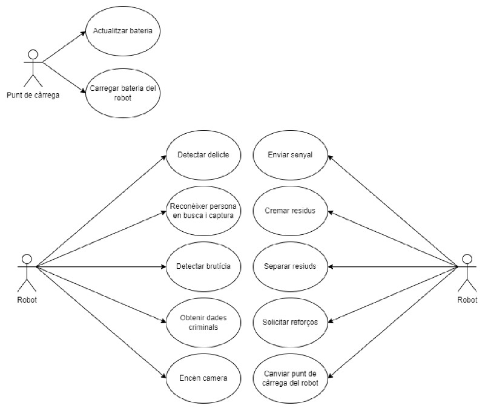
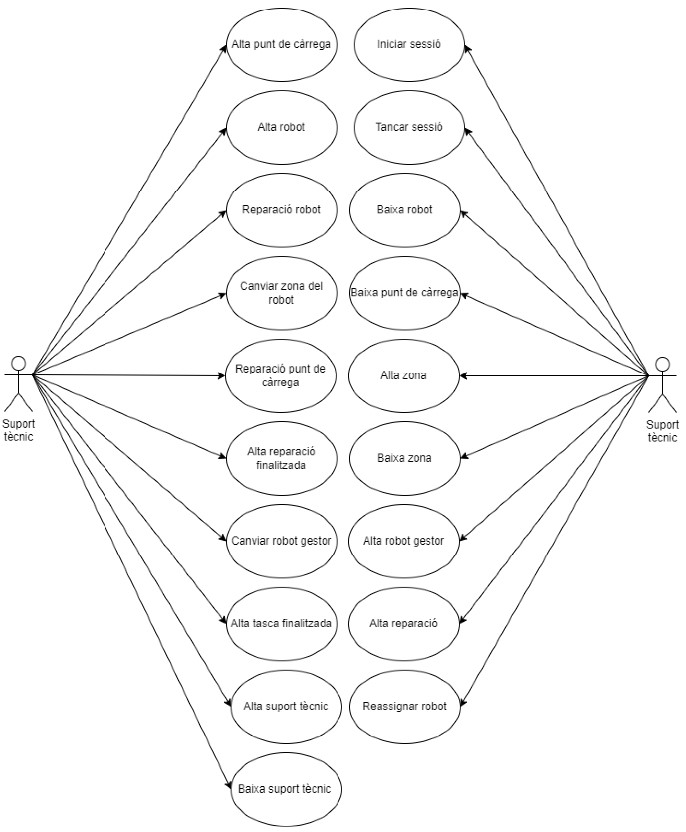
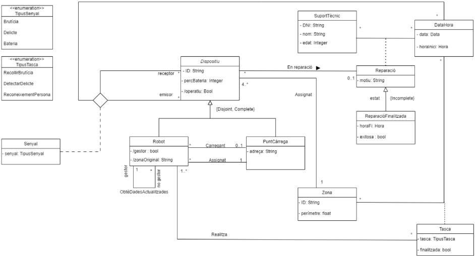
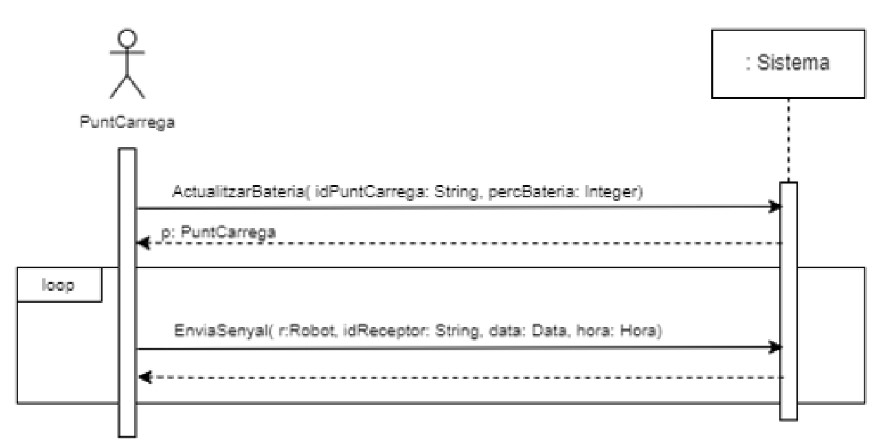
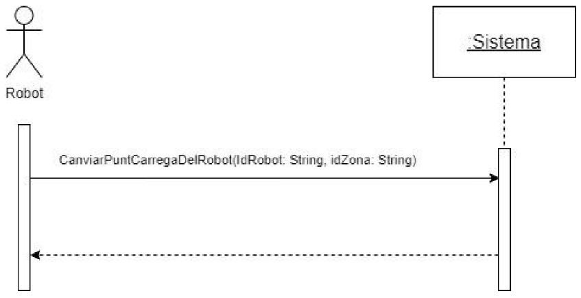
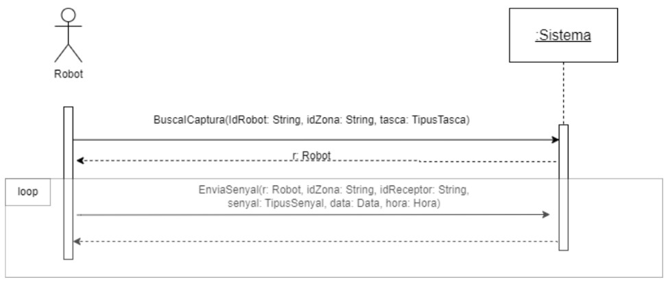
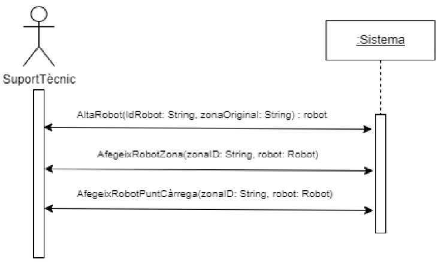
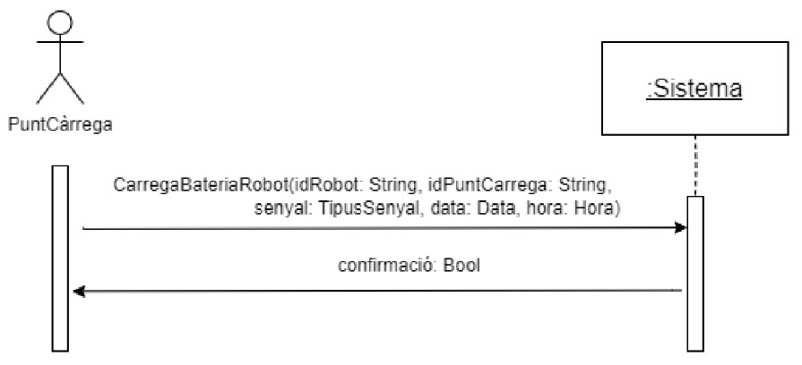
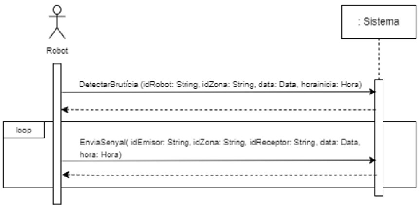

# 🏙️ ER-Project — SMART BCN. CLEAN & SAFE BCN

🗓️ Developed in February 2023

**SMART BCN. CLEAN & SAFE BCN** is a conceptual project focused on the application of Cyber-Physical Systems (CPS) aimed at improving security and cleanliness in the city of Barcelona by using interconnected robots and communication networks.

---

## 📄 Project Overview

This repository contains the **theoretical foundations** and design concepts of the project.

- The **Project_Context_Study** document covers the theoretical framework, detailing the system’s design approach and identifying key stakeholders.  
- The **Project_Requirements_Specification** document provides a comprehensive overview of the system’s technical specifications. It includes stakeholder identification, project objectives, functional and non-functional requirements, the conceptual model with OCL constraints for operation specification, user stories and UML diagrams (class and use case) that define the expected functionalities and guide the development process.
- The **Technical_Presentation** document contains the detailed technical aspects of the project, including system design, UML diagrams and use cases. It explains how the system components interact and the functionalities envisioned.
- The **Commercial_Presentation** document focuses on the business side of the project, covering market analysis, technologies used and potential stakeholders.
---

## 📷 Screenshots  

### Use Cases - ChargingPoint & Robot:

### Use Cases - TechnicalSupport:

-
### Conceptual Model:

-
### OCL - UpdateBattery:

### OCL - ChangeChargingPointRobot:

### OCL - Search&Arrest:

### OCL - RobotResgitration:

### OCL - ChargeRobotBattery:

### OCL - DirtDetection:

### OCL - CrimeDetection:

---

## ⚖️ Copyright & License

© 2023 Marc Turu Roca and collaborators. All rights reserved.  
This project is the joint intellectual property of its authors.  
No part may be copied, modified, distributed, or used without prior written permission from all authors.  

- Isaac Roma Granado  
- Rubén Dabrio Ramírez  
- Sergi Campuzano Cabot    
- Marc Turu Roca
